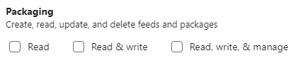

# DevOpsNugetClient
A simple library for querying Nuget packages on DevOps secure package feeds

## Our Requirement

We'd developed a new application in our existing DevOps organisation, and later moved all the code to a new organisation. This left dozens of Nuget packages
in our private feed with perhaps a few hundred versions in each. If you've tried to clean up one of these feeds manually you'll know it's very slow going, as you
have to manually delete each version of each package, one-by-one. So I decided to write a simple NUGET utility which would do this..

## Nuget Client Sucks

If you try to use the [NUGET Client API](https://github.com/NuGet/NuGet.Client) you may discover there is precious little documentation or 
support for accessing a secure NUGET feed such as those hosted on Azure DevOps. I hunted around and tried to get it working but gave up.

Instead Azure DevOps has an [excellent REST API](https://docs.microsoft.com/en-us/rest/api/azure/devops/artifacts/feed%20%20management/get%20feeds?view=azure-devops-rest-6.0) 
which also includes Package Management capabilities for the feeds on this system.

## Client

This code is designed to give a very basic example of a client that will access a secure DevOps instance. You need to provide the Organisation name and generate 
a [PersonalAccessToken](https://docs.microsoft.com/en-us/azure/devops/organizations/accounts/use-personal-access-tokens-to-authenticate?view=azure-devops&tabs=preview-page)  (PAT).

## Personal Access Token options

Ensure that you select the Packaging access rights when you generate a PAT

If you only plan to read the package data, just select `Read`. If you want to delete package versions ensure you select `Read, write and manage`
